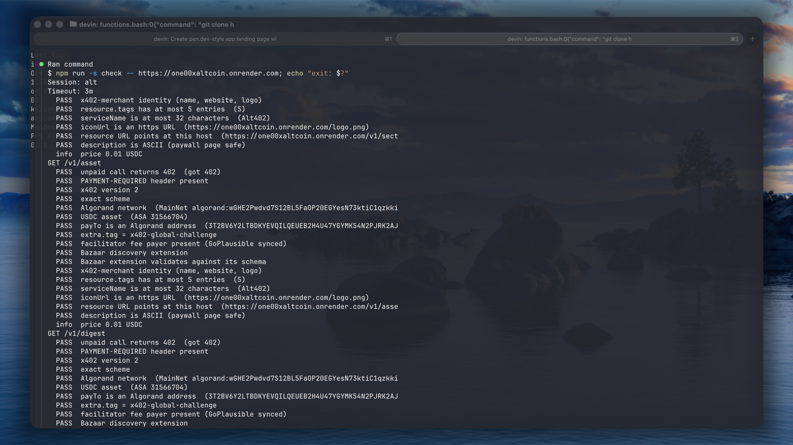

<p align="center">
  
</p>

<p align="center">
  <a href="https://one00xaltcoin.onrender.com"></a>
  
  
  
  
</p>

# Alt402

**Market intelligence for altcoins: find small caps before they move, one paid call at a time.**

Alt402 watches the CoinMarketCap top coins, keeps its own hourly rank history, and scores every
small cap on four transparent signals. You get a ranked shortlist of early, high-upside candidates,
each with a 0–100 score, the reasons behind it and its risk flags. It is built for AI agents and
trading tools. A call costs one to three cents of USDC on Algorand, paid with the
[x402](https://x402.org) protocol.

## Why Alt402

- **A shortlist, not a firehose.** One request returns the coins worth a look, scored and explained, instead of thousands of rows to sift.
- **Signals you can read.** Trading turnover, rank climb, listing age and sector heat, each scored 0–100 and shown in the response, with plain-English reasons and risk flags such as `already_pumped` and `micro_cap`.
- **Pay per call.** Settled in USDC on Algorand through x402. You are never charged for an error: bad parameters, unknown coins, stale data and missing history all answer 4xx/5xx and nothing is settled.
- **Fast and cheap to run.** A background poller keeps everything in memory, so answers are instant and cost no CoinMarketCap credits.

## Try it

Every paid route answers `402 Payment Required` until a payment is attached:

```sh
curl -i https://one00xaltcoin.onrender.com/v1/gems
```

Pay for one call from this repo. It checks the price against your limit before it signs anything:

```sh
git clone https://github.com/fozagtx/100xAltcoin && cd 100xAltcoin && npm install
AVM_MNEMONIC="25 words ..." npm run pay -- "https://one00xaltcoin.onrender.com/v1/gems?limit=5"
```

Use a separate wallet that holds only a few cents of USDC (ASA `31566704`) on Algorand MainNet.
`npm run wallet -- new` makes one for you.

## Use it from an agent

You need an AI agent with an x402 client and a funded Algorand MainNet wallet. Paste this:

```text
Read https://one00xaltcoin.onrender.com/llms.txt, then call /v1/digest and tell me which
altcoins look worth researching today and why. Pay with x402 on Algorand. Do not pay more than $0.05.
```

Or pay from your own TypeScript:

```ts
import { wrapFetchWithPaymentFromConfig } from "@x402/fetch";
import { ExactAvmScheme } from "@x402/avm/exact/client";
import { toClientAvmSigner } from "@x402/avm";

const signer = toClientAvmSigner(process.env.AVM_PRIVATE_KEY!); // base64 64-byte secret key
const pay = wrapFetchWithPaymentFromConfig(fetch, {
  schemes: [{ network: "algorand:*", client: new ExactAvmScheme(signer) }],
});
const res = await pay("https://one00xaltcoin.onrender.com/v1/gems?limit=5");
console.log(await res.json());
```

## Endpoints

| Endpoint | Price | What you get |
| --- | --- | --- |
| `GET /v1/gems` | $0.02 | Top 100x candidates: up to 50 small caps ranked by a 0–100 score, with the signal breakdown, reasons and risk flags |
| `GET /v1/screen` | $0.01 | A screener over the tracked coins. By default the 10 highest-turnover coins under $50M market cap |
| `GET /v1/climbers` | $0.01 | The biggest CoinMarketCap rank climbers (or fallers) of the last 24 hours |
| `GET /v1/sectors` | $0.01 | Hottest sectors ranked by heat, with leaders; `?sector=` returns one sector's coins |
| `GET /v1/asset` | $0.01 | One coin in detail: price, supply, score, signals, risk flags and hourly rank history |
| `GET /v1/digest` | $0.03 | Top gems, 24h climbers and hot sectors in one call |
| `GET /v1/status` | free | Health, data age, history depth, credit use and payment status |
| `GET /v1/openapi.json` | free | Every parameter, price and response, machine-readable |

Free discovery files for agents: `/llms.txt`, `/openapi.json`, `/.well-known/x402` and
`/.well-known/agent-card.json`. Parameters and response shapes are in the
[reference](./docs/REFERENCE.md#api).

A typical session: `/v1/digest` to scan, `/v1/asset?asset=<symbol>` to drill into one coin,
`/v1/sectors` for hot themes, `/v1/screen` when you have a thesis of your own, and `/v1/climbers`
for the biggest movers.

## What a response looks like

```json
{
  "as_of": "2026-10-01T09:14:00Z",
  "age_seconds": 41,
  "source": "coinmarketcap",
  "note": "Market intelligence for information only, not financial advice.",
  "history_hours": 36,
  "data": [
    {
      "symbol": "AGRIPPA", "market_cap": 3500000, "volume_24h": 2000000, "turnover": 0.57,
      "score": 54.7, "confidence": "low",
      "why": ["Listed 7 days ago", "Turnover 0.57 (volume vs market cap)"],
      "risk_flags": ["insufficient_history", "micro_cap", "new_and_unproven"],
      "signals": {
        "turnover":    { "score": 66 },
        "new_listing": { "score": 92.7 },
        "rank_climb":  { "score": 0 },
        "sector_heat": { "score": 0 }
      }
    }
  ]
}
```

`age_seconds` tells you exactly how fresh the answer is. `warnings` appears only when there is
something to know, such as `stale_data` or `insufficient_history`.

## How a call is paid

```
GET /v1/gems                     -> 402, PAYMENT-REQUIRED: amount, USDC asset, network, payTo
GET /v1/gems + PAYMENT-SIGNATURE -> facilitator verifies -> data computed -> facilitator settles
                                 -> 200, PAYMENT-RESPONSE: transaction id, payer
```

x402 v2, `exact` scheme, USDC (ASA `31566704`) on Algorand MainNet, verified and settled by the
[GoPlausible facilitator](https://facilitator.goplausible.xyz). The facilitator pays the network
fee, so the payer only needs USDC and the usual minimum Algorand account balance.

## Verified MainNet transactions

An end-to-end test run against the live service on 2026-10-01, from a fresh paying wallet to a
settled x402 payment. Every transaction is on Algorand MainNet and can be checked on
[allo.info](https://allo.info).

| Step | Transaction | Round | From → To | Amount |
| --- | --- | --- | --- | --- |
| Fund paying wallet | [`GQ2LIKSH…DTSA`](https://allo.info/tx/GQ2LIKSHHXO5UMVVPDRTO4DUMERTPQITZCERBFYTZDAUQ6CKDTSA) | 65555663 | `3T2B…GMQ` → `OWYJ…SWU` | 0.5 ALGO |
| USDC opt-in (`npm run wallet -- optin`) | [`YQFPYEKK…DYTQ`](https://allo.info/tx/YQFPYEKKU5DEJMXCYYUFLGCSYMEN4QKFGDGDYK5XXDAN4OPADYTQ) | 65555671 | `OWYJ…SWU` → self | 0 USDC (ASA 31566704) |
| Fund with USDC | [`VUFPDXMN…ILEQ`](https://allo.info/tx/VUFPDXMNRH37VJHRPAMWOBTMPF6HMFA2FKWA3NLSOLRBLOBMILEQ) | 65555704 | `3T2B…GMQ` → `OWYJ…SWU` | 1 USDC |
| **x402 payment for `/v1/digest`** (`npm run pay`) | [`UP2PDGGE…67OA`](https://allo.info/tx/UP2PDGGE2VN62FYUIM4YK5376J32VLX3DL672PCLB2VL2HOO67OA) | 65555722 | `OWYJ…SWU` → `3T2B…GMQ` | 0.03 USDC |

- Paying wallet: `OWYJYI2PFRIDSLW2V3S6QWVA4US52RVEP3F4SAQ5SKY3OFKANKRAH7ASWU`
- Payout wallet (`PAY_TO_ADDRESS`): `3T2BV6Y2LTBDKYEVQILQEUEB2H4U47YGYMK54N2PJRK2AJIX6OQX3QHGMQ`
- The payment transaction has a zero fee and sits in an atomic group: the GoPlausible facilitator
  covered the network fee, so the payer's ALGO balance did not move.
- Payout wallet USDC: 0.243178 before → 0.273178 after (+0.03). Paying wallet: 1.00 → 0.97.

The paid call itself answered `HTTP 200` with the digest JSON and this `PAYMENT-RESPONSE`:

```json
{"success":true,"payer":"OWYJYI2PFRIDSLW2V3S6QWVA4US52RVEP3F4SAQ5SKY3OFKANKRAH7ASWU","transaction":"UP2PDGGE2VN62FYUIM4YK5376J32VLX3DL672PCLB2VL2HOO67OA","network":"algorand:wGHE2Pwdvd7S12BL5FaOP20EGYesN73ktiC1qzkkit8="}
```

`npm run check -- https://one00xaltcoin.onrender.com` passed every check on all six paid routes
before the payment was made (see the screenshot at the top of this page).

## Run your own

```sh
npm install
npm run fake-cmc                                                     # stand-in CoinMarketCap on :8181
CMC_BASE_URL=http://localhost:8181 X402_ENABLED=false npm run dev    # everything free
curl 'localhost:3000/v1/gems?limit=5'
```

To deploy on Render, push this repo and choose **New → Blueprint**. `render.yaml` sets MainNet, the
GoPlausible facilitator, a disk for the history file and the health check; you enter your
`CMC_API_KEY` and `PAY_TO_ADDRESS` (a public address that is opted in to USDC, never a recovery
phrase). Then verify the live service:

```sh
npm run check -- https://<your-host>
```

The full steps, every setting and the operations notes are in the
[reference](./docs/REFERENCE.md#deploy-to-render).

## Docs

- [Reference](./docs/REFERENCE.md): endpoints and parameters, scoring, data sources, configuration, deploy, operations
- [How the score works](./docs/REFERENCE.md#how-the-score-works)
- [Global x402 Challenge entry](./docs/REFERENCE.md#global-x402-challenge): how this is listed and how to get paid calls on the leaderboard
- [Limits](./docs/REFERENCE.md#limits)

> Market intelligence for information only, not financial advice. The score ranks candidates for
> review; it does not predict prices.
